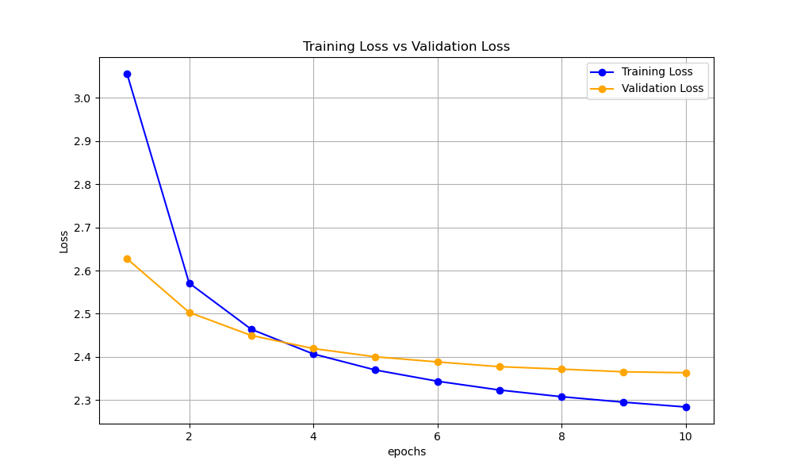

# Image Captioning Project (Comparison of CNN-LSTM, Attention, and Transformers)
A PyTorch implementation comparing sequence generation architectures on the MS COCO dataset.

Attention LSTM loss:

## Project Environment
* **Primary Python Version:** 3.10
* **Dataset:** MS COCO (Karpathy Splits)
* **Hardware Support:** Multi-platform (Cloud TPU/GPU & Local CUDA)
# important Dependency 
We have different hardware environments, so we separated our dependencies from pytorch
* **`torch` & `torchvision`:** The core deep learning framework and pre-trained CNNs (ResNet).
* **`pycocotools` & `pycocoevalcap`:** Needed for parsing MS COCO's massive JSON annotations and calculating standard image captioning metrics (BLEU, METEOR, CIDEr).
* **`Pillow`:** Backend image processing required before feeding images to PyTorch.
* **`pyyaml`:** Used to read our `.yaml` hyperparameter configuration files.

# Setup
**Important:** Please do not commit the MS COCO dataset or `.pth` model weights to GitHub. Place datasets inside `/data` and weights inside `/checkpoints`.
### Cloud use ( Colab)
These platforms already have optimized GPU drivers, `torch`, and `torchvision` pre-installed. 
Clone this repository.
Run pip install -r requirements.txt
  
### Local
Clone the repo
create and activate a Conda environment with correct python version 3.10
install pytorch and cuda depending on gpu
pip install -r requirements.txt

### Datasets (either run script for Linux or Manually)
script (linux)
cd scripts
bash download_coco.sh 
OR manually downlaod the datasets (windows or if the script doesnt work)
Click the links below to download the dataset zips via your browser. 
1. [Karpathy Splits JSON (caption_datasets.zip)](http://cs.stanford.edu/people/karpathy/deepimagesent/caption_datasets.zip)
2. [MS COCO Train 2014 (train2014.zip)](http://images.cocodataset.org/zips/train2014.zip)
3. [MS COCO Val 2014 (val2014.zip)](http://images.cocodataset.org/zips/val2014.zip)
Move the dataset_coco.json to data/annotations
Unzip Train 2014 into data/images/train2014
Unzip Val 2014 into data/iamges/val2014
### Github
when working on this, create feature branches and then merge to main when done.
